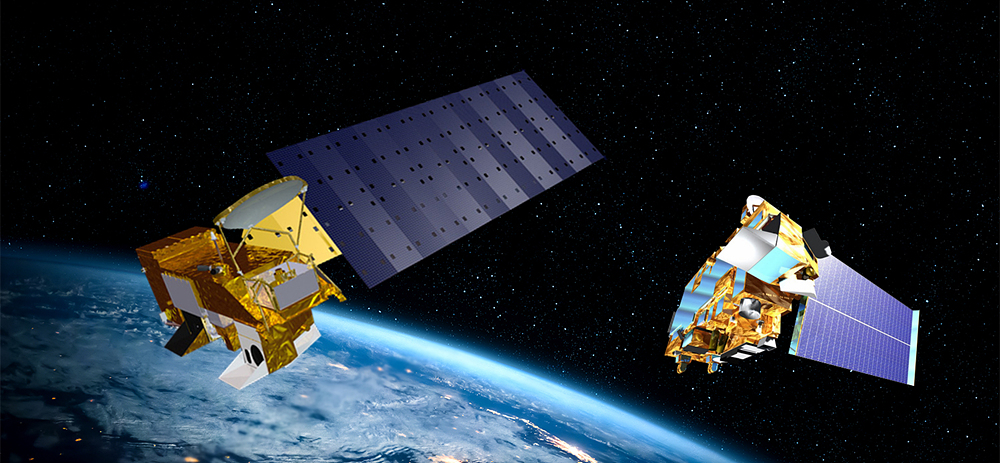

---
title: "MODIS Aqua and Terra"
subtitle: ""
author: "Madeleine Potter"
date: "01/16/2023 (updated: `r Sys.Date()`)"
output:
  xaringan::moon_reader:
    css: ["default", "default-fonts", "custom-style.css"]
    lib_dir: libs
    nature:
      highlightStyle: github
      highlightLines: true
      ratio: "16:9"
      slideNumber: true
      navigation: scroll
      theme: "style_mono_dark"
      base_color: "#cbf7ed"
      countIncrementalSlides: false
     
---
```{r echo=FALSE, warning=FALSE}
library(RefManageR)
BibOptions(check.entries = FALSE,
           bib.style = "authoryear",
           cite.style = "authoryear",
           style = "markdown",
           hyperlink = TRUE,
           dashed = FALSE,
           no.print.fields=c("doi", "url", "urldate", "issn"))
myBib <- ReadBib("bib_presentation.bib", check = FALSE)
```


```{r echo=FALSE, warning=FALSE}
library(xaringanExtra)
library(xaringanthemer)
library(knitr)
library(knitcitations)
#remotes::install_github("ropensci/RefManageR")
```
# Summary: What is MODIS?

- Moderate Resolution Imaging Spectroradiometer (MODIS) is a
key sensor aboard two NASA observation satellites Terra and Aqua.

- The first MODIS sensor was on the Terra satellite, launched in 1999 and the second on the Aqua satellite launched in 2002. 

- While the designed life span for both MODIS instruments was 6 years, they are still running today, with the MODIS Terra mission ending in 2025 and the MODIS Aqua mission in 2026.

- Terra crosses the equator around 10:30am (MLT) while Aqua crosses the equator roughly 2 hours after. 


```{r echo=FALSE, out.width='40%', fig.align='center', fig.cap='Terra and Aqua Satellites (SOLETOP, n.d)'}


```
---

# Summary: MODIS Aqua and Terra Sensor Information

The MODIS sensors collect both atmospheric and land surface information, on things such as:

- The properties, distribution and frequency of cloud cover.
- Properties of aerosols.
- Level of photosynthetic activity of land and marine plants.
- Land surface changes and temperatures.
- Albedo.


#Resolutions

```{r echo = FALSE }

data <- read.csv("table_resolutions_MODIS.csv")

knitr::kable(head(data), format = 'html')

```


---
# Summary: Image Examples

MODIS Aqua captured the nutrient enrichment (mainly nitrogen and phosphorous) of the Gulf of Mexico by the Mississippi River. This enrichment creates a hypoxic environment, which is now known as the Gulf of Mexico Dead Zone. 

```{r echo=FALSE, out.width='40%', fig.align='center', fig.cap='Gulf of Mexico Dead Zone. April 7th 2009 (Source: NASA Earth Observatory)'}
knitr::include_graphics('gulf_mexico.jpg')

```

---

# Applications: Studies That Have Used MODIS

### Assessing Sea Surface Temperature Trends `r Citep(myBib,"garcia-monteiroSurfaceTemperatureTrends2022")` 

This study used MODIS data to map sea surface temperatures of the Mediterranean Sea and
analyse the trends between 2003 and 2019. The paper mentioned the issue of cloudiness when 
interpreting satellite estimations as thermal radiometers cannot observe through clouds. 


### Monitoring Desertification `r Citep(myBib,"fengMonitoringDesertificationUsing2022")` 

This study used machine learning techniques on MODIS imagery to identify spatio-temporal
patterns of desertification in China between 2000 and 2018. This study also used four
MODIS products which were surface reflectance, albedo, vegetation index, and land-surface temperature.

---

# Applications: Studies That Have Used MODIS

### Urban Heat Island Assessment

This study used surface temperature, mean albedo and NDVI products from the MODIS sensor aboard
the TERRA satellite to measure the urban heat island effect in Brazil. Urban heat island intensity was measured by calculating the difference between the mean temperature of the pixels in the urban fringes and the urban areas.However, due to the low
spatial resolution of MODIS, an intra-urban analysis could not be done and instead further investigation is needed. 

### Detection of Algal Blooms `r Citep(myBib,"germanDetectionAlgalBlooms2017")`

This study used daily MODIS imagery to detect chlorophyll-a concentrations and built a cloud-free
time series of 2001-2014. By assessing this data, the paper suggested a clear range of chlorophyll-a values in which the San Roque Dam is going through a bloom event, allowing for better identification and possibilities for an early warning system. This study demonstrated MODIS' abilities to monitor 
water quality, even in in-land environments. 

---

#Reflection

- From what I have learnt, MODIS has been extremely useful in assessing global environmental changes that have helped assess the trends and state of climate change over the past 20 years. 

- Reading the studies that have used MODIS data demonstrated the vast array of environmental conditions to consider in terms of both the sensor and the phenomena you are observing. For example, in the urban heat island study, the urban heat island effect is more intense during periods of no clouds, which are also the best conditions for the MODIS sensor to collect data. The researchers therefore decided to only analyse images from Brazil's dry season.

- Another thing I learnt is that due to the relatively long lifespan of the MODIS missions, studies can create time series for quite a long period of time. This shows it is usefulness for assessing things that might be slow changing. 

- I found it cool that the MODIS sensors have managed to continue collecting data for a lot longer
than it's designed lifespan. It made me wonder about why the mission for Terra is ending in 2025 
and Aqua in 2026 however all the information I found was unclear. 


---

# References

```{r echo = FALSE, results='asis', warning = FALSE}
PrintBibliography(myBib, start = 1, end = 7)
```
